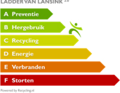

# Sustainable entrepreneurship

> “Environmentally conscious packaging is packaging that is easy to recycle. This is the case if it consists of single materials and is properly sorted. “

Because the demand for environmentally friendly products and packaging is increasing, we want to make the subject a topic for discussion in the flower world and try to include as many people as possible in the sustainable story.

Unfortunately, floriculture is highly dependent on the removal of plastic in the packaging of flowers and plants. Many people wonder whether bioplastics would not be a better alternative. We have tried, but it does not turn out to be a good solution. Moreover, they break down just as badly as plastics from oil (including BOPP film); in nature it takes them 400 years.

A global solution is currently being sought that is best for the industry and for the world. Plastic does not have to be banned immediately. You can also use recycled plastic and recycle it so that it is a good raw material.

To score well on Lansink's ladder, Rouverpa strives for transparency, sustainability and, above all, a focus on a circular economy. A **circular** economy ensures the recovery of high-quality raw materials so that raw materials do not run out.

“You cannot achieve sustainable packaging by avoiding plastic,” says Nynke Arntzen, packaging expert at the Knowledge Institute for Sustainable Packaging (KIDV). The packaging must fulfill its function with only the necessary materials and energy. Reuse or recyclability must be included in the design process. The focus must be on the product. After all, the environmental impact of a product is on average 90%; of the packaging this is 10%. Currently, the recycling of plastic leaves a lot to be desired. Biodegradable "plastics" can also cause problems in waste processing."
[Read more about this](https://www.plasticsoupfoundation.org/wp-content/uploads/2018/09/september-2018.-Bloemisterij.-Verpakken-kan-een-STUK-duurzamer.pdf)

## Challenges

> Mandatory to add 25% to production and at least 75% of the plastic must be recycled by 2025.

- By 2025, all film producers will be obliged to add 25% recycled materials to their production.
- By 2025, at least 75% of the plastic must be recycled.

## We maintain

- Environmentally friendly recyclable BI-Oriented polypropylene.
- Unique product code on all the rolls.
- Have the following two machines:
  - _A machine for pressing our plastic into bales, after which it is processed into granules in a specialized company and subsequently processed into other products._
  - _A machine to shred and re-transport the mass of waste PP strapping (located around parent roll to protect the film) to a specialized plant for processing._
- Collaboration with producers who are FSC certified.

We are always looking for suppliers who produce Bi-Oriented polyproylene in an environmentally friendly way. BOPP movies have the advantage of being **consume less plastics** and hassle free **recyclable**. This is because it is an oily material that is easy to recycle.

For our foil we refer to the following SPI resin identification code. Such a code distinguishes the type of polymer from plastic, i.e. it identifies what the product is made of.

Our film falls under recycling code PP 05 (U + 2677). The product is made of polypropylene (PP) and, as indicated, is perfectly recyclable. The code ensures that they are properly sorted and reused during the waste processing process. We certainly want to inform our customers that our products are perfectly recyclable.
[Read more about this](https://denieuweblauwezak.be)

In addition, each main roll of foil receives one **unique product code** so that the origin of the product is always known. For our paper we work together with producers who are **FSC certified**.

We **sort** very strictly our paper and plastic waste. We **squeeze** our plastic internally and transport it to a specialized company. They process it on site **waste to granules** and which are used in the processing into hard plastic for, for example, garden furniture, flower pots...
