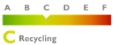
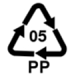
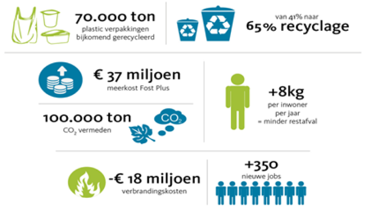

# Entrepreneuriat durable

> “Les emballages respectueux de l'environnement sont des emballages faciles à recycler. C'est le cas s'il est constitué de matériaux uniques et est correctement trié. "

Parce que la demande de produits et d'emballages respectueux de l'environnement augmente, nous voulons faire du sujet un sujet de discussion dans le monde des fleurs et essayer d'inclure autant de personnes que possible dans l'histoire durable.

Malheureusement, la floriculture dépend fortement de l'élimination du plastique dans l'emballage des fleurs et des plantes. Beaucoup de gens se demandent si les bioplastiques ne seraient pas une meilleure alternative. Nous avons essayé, mais cela ne s'avère pas être une bonne solution. De plus, ils se décomposent aussi mal que les plastiques issus du pétrole (y compris le film BOPP); dans la nature, cela leur prend 400 ans.

Une solution globale est actuellement recherchée qui soit la meilleure pour l'industrie et pour le monde. Le plastique ne doit pas être interdit immédiatement. Vous pouvez également utiliser du plastique recyclé et le recycler pour en faire une bonne matière première.

Pour bien marquer sur l'échelle de Lansink, Rouverpa vise la transparence, la durabilité et, surtout, une focalisation sur une économie circulaire. Une **circulaire** économie assure la récupération de matières premières de haute qualité afin que les matières premières ne s'épuisent pas.

«Vous ne pouvez pas obtenir un emballage durable en évitant le plastique», déclare Nynke Arntzen, experte en emballage au Knowledge Institute for Sustainable Packaging (KIDV). L'emballage doit remplir sa fonction avec uniquement les matériaux et l'énergie nécessaires. La réutilisation ou la recyclabilité doit être incluse dans le processus de conception. L'accent doit être mis sur le produit. Après tout, l'impact environnemental d'un produit est en moyenne de 90%; de l'emballage c'est 10%. Actuellement, le recyclage du plastique laisse à désirer. Les "plastiques" biodégradables peuvent également poser des problèmes dans le traitement des déchets."
[En savoir plus à ce sujet](https://www.plasticsoupfoundation.org/wp-content/uploads/2018/09/september-2018.-Bloemisterij.-Verpakken-kan-een-STUK-duurzamer.pdf)

## Défis

> Obligation d'ajouter 25% à la production et au moins 75% du plastique doit être recyclé d'ici 2025.

- D'ici 2025, tous les producteurs de films seront obligés d'ajouter 25% de matériaux recyclés à leur production.
- D'ici 2025, au moins 75% du plastique doit être recyclé.

## Nous maintenons

- Polypropylène bi-orienté recyclable respectueux de l'environnement.
- Code produit unique sur la liste des parents.
- Ayez les deux machines suivantes:
  - _Une machine pour presser notre plastique en balles, après quoi il est transformé en granulés dans une entreprise spécialisée et ensuite transformé en d'autres produits._
  - _Une machine pour déchiqueter et re-transporter la masse des déchets de cerclage PP (situés autour du rouleau parent pour protéger le film) vers une usine spécialisée pour traitement._
- Collaboration avec des producteurs certifiés FSC.

Nous sommes toujours à la recherche de fournisseurs qui produisent du polyproylène bi-orienté de manière écologique. Les films BOPP ont l'avantage d'être **consommez moins de plastiques** et sont **recyclables** sans aucun problème. En effet, il s'agit d'un matériau huileux facile à recycler.

Pour notre feuille, nous nous référons au code d'identification de résine SPI suivant. Un tel code distingue le type de polymère du plastique, c'est-à-dire qu'il identifie de quoi est fait le produit.

Notre film relève du code de recyclage PP 05 (U + 2677). Le produit est en polypropylène (PP) et est parfaitement recyclable comme indiqué. Le code garantit qu'ils sont correctement triés et réutilisés pendant le processus de traitement des déchets. Nous voulons certainement informer nos clients que nos produits sont parfaitement recyclables.
[En savoir plus à ce sujet](https://denieuweblauwezak.be)

De plus, chaque rouleau de papier mère reçoit un **code produit unique** afin que l'origine du produit soit toujours connue. Pour notre papier, nous travaillons avec des producteurs qui sont **Certifié FSC**.

Nous **trions** très strictement nos déchets de papier et de plastique. Nous **pressons** notre plastique en interne et le transporter vers une entreprise spécialisée. Ils le traitent sur place **déchets en granulés** et qui sont utilisés dans la transformation en plastique dur pour les meubles de jardin, les pots de fleurs...

## Le nouveau sac bleu:

Le nouveau sac bleu nous permettra désormais de collecter, trier et recycler encore plus d'emballages. Nos films peuvent également être mis dans les nouveaux sacs bleus.

Rouverpa soutient les nouveaux sacs bleus. Fost Plus est l'initiateur du nouveau sac bleu. Nous essayons de faire tout ce que nous pouvons en interne pour rendre nos processus aussi respectueux de l'environnement que possible, mais nous voulons maintenant transmettre cela à nos clients. Nous insistons pour que nos produits soient recyclés correctement, de sorte que moins de déchets résiduels soient utilisés et que le CO2 soit réduit.

Vérifiez-vous également si c'est au tour de votre municipalité?
Aller à [denieuwblauwezak.be](https://.denieuweblauwezak.be/nl/wanneer)
