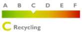

# Duurzaam ondernemen

> “Een milieubewust verpakking is een verpakking die goed te recycleren is. Dat is het geval als hij uit enkelvoudige materialen bestaat en goed is gesorteerd. “

Doordat de vraag naar milieuvriendelijke producten en verpakkingen toeneemt, willen wij het onderwerp in de bloemenwereld bespreekbaar maken en proberen zoveel mogelijk mensen mee te nemen in het duurzaam verhaal.

Helaas is de sierteelt sterk afhankelijk van het afnemen van plastic in de verpakking van bloemen en planten. Veel mensen vragen zich af of bioplastics geen beter alternatief zouden zijn. Wij hebben het geprobeerd, maar het blijkt geen goede oplossing te zijn. Meer nog, ze breken echter net zo slecht af als plastics uit olie (o.a. BOPP-film); in de natuur doen ze daar 400 jaar over.

Momenteel wordt er naar een globale oplossing gezocht die het best is voor de sector en voor de wereld. Plastic hoeft niet meteen gebannen te worden. Men kan ook gerecycleerd plastic gebruiken, en dit weer recyclen, zodat het een prima grondstof is.

Om goed te scoren op de ladder van Lansink streeft Rouverpa naar transparantie, duurzaamheid en vooral een focus op een circulaire economie. Een **circulaire** economie zorgt voor een recuperatie van hoogwaardige grondstoffen waardoor de grondstoffen niet uitgeput geraken.

“Duurzaam verpakken bereik je niet door plastic te vermijden, zegt Nynke Arntzen, verpakkingskundige van het Kennisinstituut Duurzaam Verpakken (KIDV). De verpakking moet haar functie vervullen met alleen het nodige aan materialen en energie. Het hergebruik of de recyclebaarheid moeten worden meegenomen in het ontwerpproces. Daarbij moet de focus op het product liggen. Immers, de milieu-impact van een product is gemiddeld 90%; van de verpakking is dat 10%. Momenteel laat de recycling van plastic nogal te wensen over. Ook kunnen biologisch afbreekbare ‘plastics’ voor problemen zorgen in de afvalverwerking.”
[Lees meer hierover](https://www.plasticsoupfoundation.org/wp-content/uploads/2018/09/september-2018.-Bloemisterij.-Verpakken-kan-een-STUK-duurzamer.pdf)

## Uitdagingen

> Verplicht 25% toe te voegen aan productie en minimaal 75% van het plastic moet gerecycleerd worden in 2025.

- In 2025 zijn alle producenten van folie verplicht om 25% gerecycleerde materialen toe te voegen aan hun productie.
- In 2025 moet minimaal 75% van het plastic worden gerecycled.

## Wij handhaven

- Milieuvriendelijke recycleerbare BI-Oriented polypropylene.
- Unieke productcode op moederrol.
- Beschikken over volgende twee machines:
  - _Een machine om ons plastic te persen in balen waarna het in een gespecialiseerd bedrijf wordt verwerkt tot korrels om nadien in andere producten te worden verwerken._
  - _Een machine om de massa aan afval PP-omsnoeringsbanden (bevinden zich rondom moederrol om bescherming van de folie te vrijwaren) te versnipperen en opnieuw te transporteren naar een gespecialiseerd bedrijf ter verwerking._
- Samenwerking met producenten die FSC-gecertificeerd zijn.

Wij zoeken telkens naar leveranciers die op een milieuvriendelijke manier Bi-Oriented polyproylene produceren. BOPP-films hebben het voordeel dat ze **minder kunststoffen verbruiken** en probleemloos **recycleerbaar** zijn. Het is namelijk een oliehoudend materiaal dat uitstekend te recycleren is.

Voor onze folie verwijzen we naar de volgende SPI resin identificatie code. Zo’n code onderscheidt het type polymeer van plastic, m.a.w. het identificeert waaruit het product is gemaakt.

Onze folie valt onder recyclingcode PP 05 (U+2677). Het product is gemaakt van polypropyleen (PP) en is zoals aangegeven perfect recyclebaar. De code zorgt dat zij tijdens het proces van afvalverwerking op de juiste manier gesorteerd en hergebruikt worden. Wij willen zeker aan onze klanten meegeven dat onze producten perfect recycleerbaar zijn.
[Lees meer hierover](https://denieuweblauwezak.be)

Daarnaast krijgt elke moederrol folie een **unieke productcode** zodat de oorsprong van het product steeds bekend is. Voor ons papier werken wij samen met producenten die **FSC-gecertificeerd** zijn.

Wij **sorteren** heel strikt ons papier- en plastic afval. Wij **persen** intern ons plastic en vervoeren dat naar een gespecialiseerde firma. Ter plaatse verwerken ze het **afval tot korrels** en die worden gebruikt in de verwerking tot harde plastic voor bijvoorbeeld tuinmeubelen, bloempotten…

## De nieuwe blauwe zak:

De nieuwe blauwe zak zal zorgen dat we vanaf nu nog meer verpakkingen kunnen inzamelen, sorteren en recycleren. Ook onze folies mogen in de nieuwe blauwe zakken gestoken worden.

Rouverpa steunt de nieuwe blauwe zakken. Fost Plus is de initiatiefnemer van de nieuwe blauwe zak. Intern proberen wij er alles aan te doen om onze processen zo milieuvriendelijke te maken, maar dat willen we nu ook meegeven aan onze klanten. Wij hameren erop dat onze producten op de juiste manier gerecycleerd worden, zodat er minder restafval verbruikt en CO2 gereduceerd wordt.

Bekijk jij ook of jouw gemeente al aan de beurt is?
Ga naar [denieuwblauwezak.be](https://.denieuweblauwezak.be/nl/wanneer)
