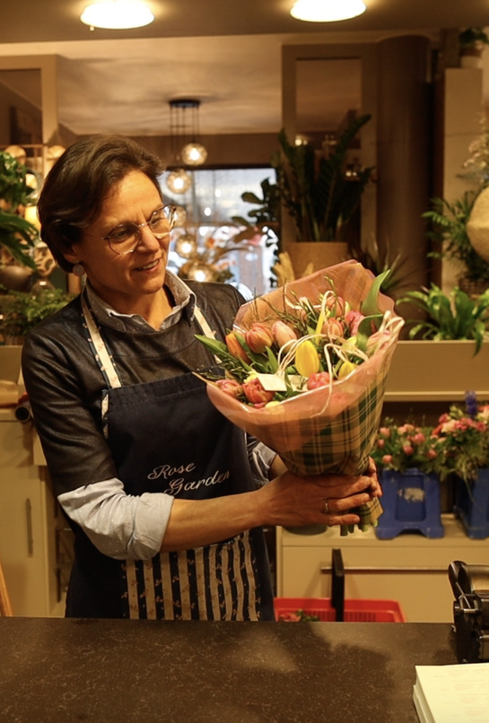
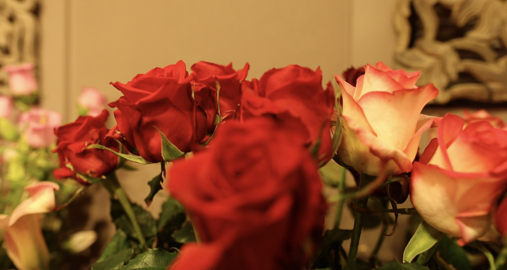
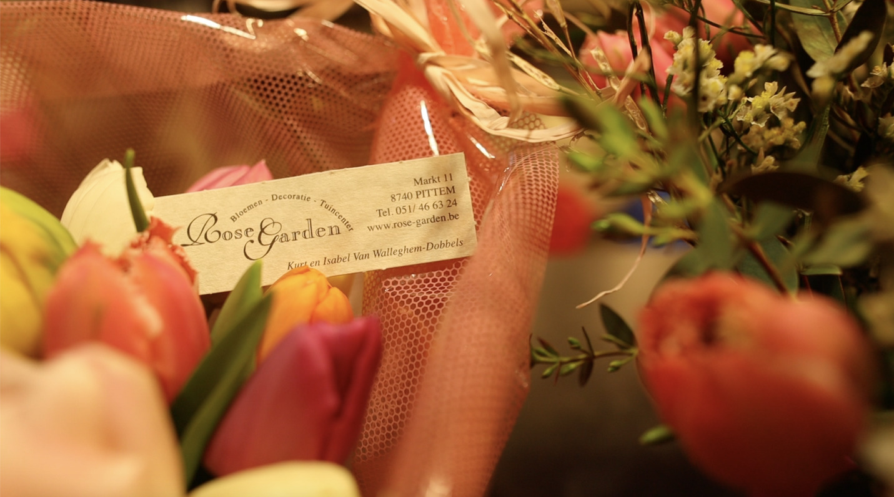

# Rose Garden illumine votre journée

> “Propriétaire très sympathique et serviable!", "Très sympathique", "Fleurs de qualité!".

Voici quelques avis Google du magasin de fleurs de [Rose Garden](https://www.rose-garden.be "Rose Garden").
**Rose Garden** est client de Rouverpa depuis de nombreuses années. Le magasin de fleurs florissant est situé à **Pittem** sur le marché.

Tous les projecteurs sont destinés sur **Isabel Dobbels**, le propriétaire de la Rose Garden.
Elle ouvre ses portes chaque jour avec beaucoup de passion et de fierté. Elle travaille avec beaucoup d'amour pour les fleurs.

Un client à l'honneur à **Rouverpa verpakkingen**!

Isabel Dobbels est mariée à Kurt Van Walleghem. Le magasin a été fondée **il y a 53 ans** par ses beaux-parents dans un ancien manoir de Pittem. L'affaire a été systématiquement élargie. Depuis 1998, l'entreprise a été reprise par Isabel et son mari.Isabel est en charge du **commerce des fleurs** et son mari continue ce que son père a toujours fait, **cultiver les fleurs coupées**. En attendant, le fils **Matice** aide également à la pépinière.

N'hésitez pas à regarder la vidéo en néerlandais ou lire la suite.

    <iframe src="https://www.youtube-nocookie.com/embed/KhWeOf_nqps" title="Rose Garden klant in de kijker bij Rouverpa" frameborder="0" allow="accelerometer; autoplay; clipboard-write; encrypted-media; gyroscope; picture-in-picture" allowfullscreen></iframe>

La principale culture de la pépinière est la fleur **astronomia**. Ils poussent **14 couleurs**. Habituellement la fleur
utilisé dans un bouquet mixte, mais il peut également être utilisé seul. La fleur est très durable, spéciale
et décoratif.

De plus, ils cultivent également **30 types de tulipes différents**. La culture des tulipes a lieu de janvier à avril.
Ils coupent leurs tulipes fraîches tous les jours. Les tulipes sont toutes deux vendues dans la boutique, mais également livrées aux enchères en Bruxelles. Kurt se rend toujours à Bruxelles avant l'aube pour livrer les fleurs.

L'expérience dans leur magasin physique est la plus importante pour eux. Il est agréable pour les clients de sentir l'odeur des fleurs fraîches. Mais en plus de leur **magasin physique** , ils ont également un **site Web avec une boutique en ligne**. Cela devient de plus en plus un média important dans le secteur des fleurs. Les gens aiment regarder à l'avance l'assortiment de fleurs.

Une partie très importante du bouquet est à la fois de faire le bouquet avec une belle
fleurs, ainsi que **l'emballage** autour du bouquet. Quand les gens demandent à Isabel de faire un bouquet ou un arrangement floral bien sûr, elle le fait avec beaucoup de soin. Elle aime faire son travail pour bien envelopper la fleur pour
les clients. Elle ne peut en fait donner aucune des fleurs non emballées.

Elle utilise souvent le **kraft** et la **feuille colorée**. Le kraft se décline en différents types avec ou sans motif
et la feuille colorée est disponible en différentes couleurs. De cette façon, elle peut adapter la couleur **à la couleur
des fleurs**, Isabel aime être créative avec ça. De plus, ils utilisent également la **feuille transparente**.
Et pour finir le bouquet complètement, ils le décorent avec un ruban **dekoraphia** autour de l'emballage.

Comment sont-ils arrivés à Rouverpa?
Les beaux-parents d'Isabel étaient déjà clients de Rouverpa. En fait, dès le premier jour où Rouverpa a fait le travail,
Geert a fini avec ma belle-mère. Lorsqu'ils ont repris l'entreprise, ils ont décidé de continuer à travailler avec
Rouverpa. **«Lorsque vous êtes heureuse, vous laissez les gens revenir.»**, déclare Isabel Dobbels. Une belle collaboration,
le lien familial avec un chat rend la collaboration si bonne. Rose Garden opère maintenant **depuis plus de 30 ans**
avec Rouverpa.

Chez Rouverpa, nous souhaitons à Isabel et à son mari le meilleur pour l'avenir. Nous admirons la passion et la fierté.
