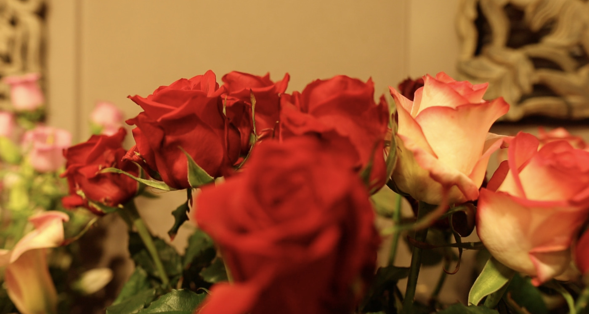

# Rose Garden fleurt je dag

> "Zeer sympathieke en hulpvaardige eigenares!", "Zeer vriendelijk", "Kwalitatieve bloemen!".

Dit zijn enkele Google reviews van bloemenzaak [Rose Garden](https://www.rose-garden.be "Rose Garden").
**Rose Garden** is al jaar en dag klant bij Rouverpa. De bloeiende bloemenzaak is gelegen in **Pittem** aan de markt.

Alle spotlights zijn gericht op de altijd goedlachse **Isabel Dobbels**, de eigenares van Rose garden.
Zij doet elke dag met veel passie en trotsheid haar deuren open. Met veel liefde voor de bloemen gaat ze te werk.

Een klant in de kijker bij **Rouverpa verpakkingen**!

Isabel Dobbels is getrouwd met Kurt Van Walleghem. De zaak werd **53 jaar geleden** opgericht door haar schoonouders
in een oud herenhuis in Pittem. De zaak werd stelselmatig uitgebreid. Sedert 1998 werd de zaak overgenomen door
Isabel en haar man. Isabel houdt zich bezig met de **bloemenzaak** en haar man doet verder wat zijn vader altijd gedaan heeft,
namelijk de snijbloemen **kweken.** Ondertussen helpt ook zoon **Matice** mee in de kwekerij.

Bekijk gerust de video of lees verder.

    <iframe src="https://www.youtube-nocookie.com/embed/KhWeOf_nqps" title="Rose Garden klant in de kijker bij Rouverpa" frameborder="0" allow="accelerometer; autoplay; clipboard-write; encrypted-media; gyroscope; picture-in-picture" allowfullscreen></iframe>

De hoofdteelt van de kwekerij is de **astronomia** bloem. Daarvan kweken ze een **14 tal kleuren**. Meestal wordt de bloem
gebruikt in een gemengd boeket, maar dat kan ook evengoed solitair gebruikt worden. De bloem is heel duurzaam, speciaal
en decoratief.

Daarnaast kweken ze ook een **30 tal verschillende soorten tulpen**. De tulpenteelt vindt plaats van januari tot april.
Dagelijks snijden ze hun verse tulpen. De tulpen worden zowel verkocht in de winkel, maar ook aangeleverd op de veiling in
Brussel. Kurt gaat steeds voor dag en dauw naar Brussel om de bloemen aan te leveren.

De beleving in hun fysieke winkel vinden ze nog altijd het meest belangrijk.
Het is aangenaam voor de klanten om de geur van de verse bloemen op te snuiven. De bloemen springen zo meer in het oog.
Maar naast hun **fysieke winkel** hebben ze ook een **website met webshop**. Dit wordt meer en meer een belangrijk medium
in de bloemensector. De mensen kijken graag al eens op voorhand naar het assortiment bloemen.

Een heel belangrijk onderdeel van het boeket is zowel het boeket maken met mooie
bloemen, als ook de **verpakking** rond het boeket. Als de mensen aan Isabel vragen om een boeket te maken of een bloemstuk
te verpakken, dan doet ze dat uiteraard met heel veel zorg. Ze maakt graag haar werk om de bloem mooi te verpakken voor
de klanten. Ze kan eigenlijk niets van bloemen onverpakt meegeven.

Ze gebruikt veel de **kraft** en **ingekleurde folie**. De kraft bestaat in verschillende soorten met of zonder motief
en de ingekleurde folie bestaat in verschillende kleuren. Zo kan ze eigenlijk het kleur **aanpassen aan de kleur
van de bloemen**, daar is Isabel graag creatief mee bezig. Daarnaast gebruiken ze ook nog de **transparante folie**.
En om het boeket volledig af te werken, versieren ze het met een **dekoraphia** lint rondom de verpakking.

Hoe zijn ze bij Rouverpa terechtgekomen?
De schoonouders van Isabel waren al reeds klant bij Rouverpa. Eigenlijk dus al vanaf dag 1 dat Rouverpa de baan deed,
is Geert terechtgekomen bij mijn schoonmoeder. Toen ze de zaak overnamen, hebben ze beslist om verder samen te werken met
Rouverpa. **“Als je tevreden bent, dan laat je de mensen terugkomen.”**, zegt Isabel Dobbels. Een leuke samenwerking,
familaire band met een babbeltje maakt de samenwerking zo goed. Rose Garden werkt nu ondertussen **al meer dan 30 jaar**
samen met Rouverpa.

Wij van Rouverpa wensen Isabel en haar man het beste toe voor de toekomst. Wij bewonderen de passie en trotsheid enorm.
